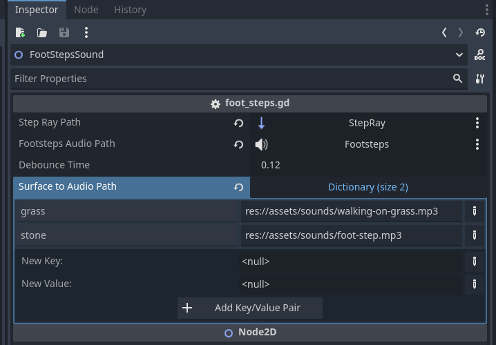

# FootSteps Sound 2D

---

_A powerful Godot plugin for dynamic, immersive footstep sounds based on surface type. Easily map custom sounds to different surfaces and bring your 2D worlds to life!_

---



## Features

- Effortless integration with your 2D character scenes
- Detects ground surface type using RayCast2D
- Customizable sound mapping for each surface (grass, stone, etc.)
- Adjustable debounce time to control step frequency
- Randomized pitch for natural sound variation
- Simple, inspector-based configuration

---

## Quick Start

1. **Add the Plugin**

   - In your character scene (e.g., `player.tscn`), add a new `Node2D` as a child (e.g., `FootSteps2D`).
   - Attach the `footstep-sound.gd` script to this node.

2. **Scene Setup**

   - Add a `RayCast2D` node (for ground detection).
   - Add an `AudioStreamPlayer` node (for playing sounds).

3. **Inspector Configuration**

   - `step_ray_path`: Path to your `RayCast2D` node (e.g., `../StepRay`).
   - `footsteps_audio_path`: Path to your `AudioStreamPlayer` node (e.g., `../Footsteps`).
   - `debounce_time`: Minimum time between steps (default: 0.12s).
   - `surface_to_audio_path`: Map surface names (from your `TileMap` custom data) to audio file paths.

4. **TileMap Setup**

   - In your `TileMap`, set custom data for each tile (e.g., `"surface": "grass"`).

5. **Triggering Footsteps**
   - In your character's script, call the `step()` method on the `FootSteps2D` node whenever a step sound should play.

---

## Example Usage

```
# In your character script
func _ready():
    footsteps_node = $FootSteps2D  # Adjust the path as needed

func _process(_delta):
    if footsteps_node:
        footsteps_node.step()
```

---

## Author

itsjinhk

## License

MIT
