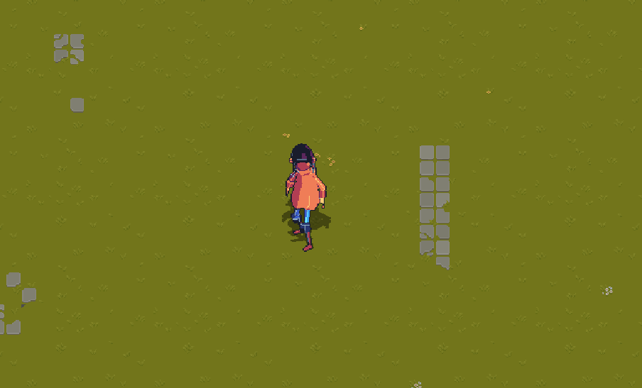

# Shadow Plugin for Godot 2D

Easily add and customize 2D character shadows in your Godot projects using this plugin. It provides a script and a shader for visually appealing, dynamic shadows that follow your characters and update with their animations.

**Special thanks to [deakcor shader](https://godotshaders.com/shader/shadow-2d/)**

## Features

- Simple integration for 2D character shadows
- Customizable shadow position and scale
- Dynamic shadow texture updates based on character animation
- Lightweight shader for soft, colored shadows

## Files

- `shadow.gd`: Main script to control shadow behavior
- `shadow.gdshader`: Shader for rendering the shadow effect
- `plugin.cfg`: Plugin configuration

## Usage

1. **Attach the Script**: Add the `shadow.gd` script to a `Node2D` in your character scene.
2. **Configure Exports**:
   - `shadow_path`: Set this to the path of the `Sprite2D` node that will display the shadow.
   - `shadow_position`: Adjust the shadow's offset relative to the character.
   - `shadow_scale`: Set the scale for the shadow (e.g., wider and flatter for a ground shadow).
3. **Apply the Shader**: Assign `shadow.gdshader` to the shadow `Sprite2D`'s material for a soft, colored shadow effect.
4. **Dynamic Updates**: Call `update_shadow(character_animation)` from your animation logic to update the shadow's texture based on the current animation frame.

## Example

```
# In your character's script:
$ShadowController.update_shadow($AnimationPlayer)
```



## Author

itsjinhk

## License

MIT
